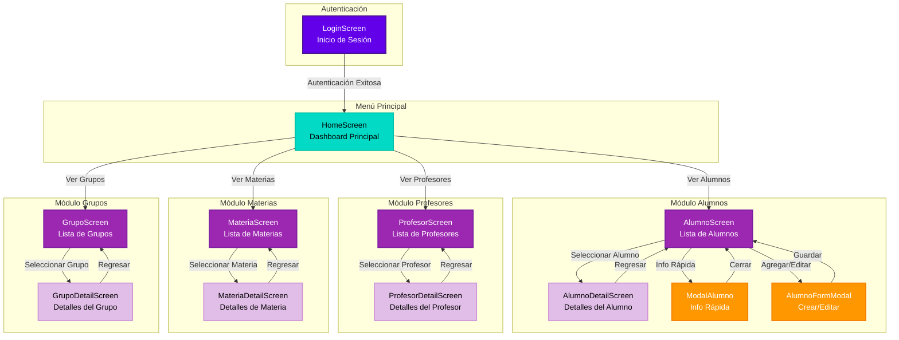

```mermaid
graph TB
    %% Diagrama de Flujo de Navegación Principal
    %% Sistema de Gestión Escolar - React Native TypeScript
    
    subgraph Autenticación
        Login[LoginScreen<br/>Inicio de Sesión]
    end
    
    subgraph "Menú Principal"
        Home[HomeScreen<br/>Dashboard Principal]
    end
    
    subgraph "Módulo Alumnos"
        AlumnoList[AlumnoScreen<br/>Lista de Alumnos]
        AlumnoDetail[AlumnoDetailScreen<br/>Detalles del Alumno]
        AlumnoModal[ModalAlumno<br/>Info Rápida]
        AlumnoForm[AlumnoFormModal<br/>Crear/Editar]
    end
    
    subgraph "Módulo Profesores"
        ProfesorList[ProfesorScreen<br/>Lista de Profesores]
        ProfesorDetail[ProfesorDetailScreen<br/>Detalles del Profesor]
    end
    
    subgraph "Módulo Materias"
        MateriaList[MateriaScreen<br/>Lista de Materias]
        MateriaDetail[MateriaDetailScreen<br/>Detalles de Materia]
    end
    
    subgraph "Módulo Grupos"
        GrupoList[GrupoScreen<br/>Lista de Grupos]
        GrupoDetail[GrupoDetailScreen<br/>Detalles del Grupo]
    end
    
    %% Flujo Principal
    Login -->|Autenticación Exitosa| Home
    
    %% Navegación desde Home
    Home -->|Ver Alumnos| AlumnoList
    Home -->|Ver Profesores| ProfesorList
    Home -->|Ver Materias| MateriaList
    Home -->|Ver Grupos| GrupoList
    
    %% Módulo Alumnos
    AlumnoList -->|Seleccionar Alumno| AlumnoDetail
    AlumnoList -->|Info Rápida| AlumnoModal
    AlumnoList -->|Agregar/Editar| AlumnoForm
    AlumnoForm -->|Guardar| AlumnoList
    AlumnoModal -->|Cerrar| AlumnoList
    AlumnoDetail -->|Regresar| AlumnoList
    
    %% Módulo Profesores
    ProfesorList -->|Seleccionar Profesor| ProfesorDetail
    ProfesorDetail -->|Regresar| ProfesorList
    
    %% Módulo Materias
    MateriaList -->|Seleccionar Materia| MateriaDetail
    MateriaDetail -->|Regresar| MateriaList
    
    %% Módulo Grupos
    GrupoList -->|Seleccionar Grupo| GrupoDetail
    GrupoDetail -->|Regresar| GrupoList
    
    %% Estilos
    classDef loginClass fill:#6200ea,stroke:#4a148c,color:#fff,stroke-width:2px
    classDef homeClass fill:#03dac6,stroke:#00bfa5,color:#000,stroke-width:2px
    classDef moduloClass fill:#9c27b0,stroke:#7b1fa2,color:#fff,stroke-width:2px
    classDef detailClass fill:#e1bee7,stroke:#ce93d8,color:#000,stroke-width:2px
    classDef utilClass fill:#ff9800,stroke:#f57c00,color:#fff,stroke-width:2px
    
    class Login loginClass
    class Home homeClass
    class AlumnoList,ProfesorList,MateriaList,GrupoList moduloClass
    class AlumnoDetail,ProfesorDetail,MateriaDetail,GrupoDetail detailClass
    class AlumnoModal,AlumnoForm utilClass
```
