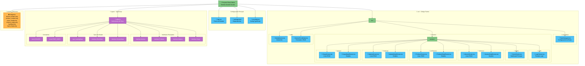

```mermaid
graph TD
    %% Estructura de Archivos y Carpetas del Proyecto
    %% React Native TypeScript - Sistema de Gestión Escolar
    
    Root[📁 Proyecto React Native<br/>Sistema Gestión Escolar]
    
    subgraph "Configuración Principal"
        AppTsx[📄 App.tsx<br/>Punto de Entrada]
        PackageJson[📄 package.json<br/>Dependencias]
        TsConfig[📄 tsconfig.json<br/>Config TypeScript]
    end
    
    subgraph "📁 src/ - Código Fuente"
        SrcFolder[src/]
        
        subgraph "📁 navigation/"
            StackNav[📄 StackNavigator.tsx<br/>Configuración de Rutas]
        end
        
        subgraph "📁 screens/"
            ScreensFolder[screens/]
            
            subgraph "📁 auth/"
                LoginScreen[📄 LoginScreen.tsx<br/>Pantalla Login]
            end
            
            subgraph "📁 home/"
                HomeScreen[📄 HomeScreen.tsx<br/>Dashboard Principal]
            end
            
            subgraph "📁 alumnos/"
                AlumnoScreen[📄 AlumnoScreen.tsx<br/>Lista CRUD]
                AlumnoDetail[📄 AlumnoDetailScreen.tsx<br/>Detalles]
            end
            
            subgraph "📁 profesores/"
                ProfesorScreen[📄 ProfesorScreen.tsx<br/>Lista CRUD]
                ProfesorDetail[📄 ProfesorDetailScreen.tsx<br/>Detalles]
            end
            
            subgraph "📁 materias/"
                MateriaScreen[📄 MateriaScreen.tsx<br/>Lista CRUD]
                MateriaDetail[📄 MateriaDetailScreen.tsx<br/>Detalles]
            end
            
            subgraph "📁 grupos/"
                GrupoScreen[📄 GrupoScreen.tsx<br/>Lista CRUD]
                GrupoDetail[📄 GrupoDetailScreen.tsx<br/>Detalles]
            end
        end
        
        subgraph "📁 utils/"
            ModalAlumno[📄 ModalAlumno.tsx<br/>Modal Info]
            AlumnoFormModal[📄 AlumnoFormModal.tsx<br/>Formulario CRUD]
        end
    end
    
    subgraph "📁 types/ - TypeScript"
        TypesIndex[📄 index.ts<br/>Definiciones de Tipos]
        
        subgraph "Interfaces Principales"
            IAlumno[interface Alumno]
            IProfesor[interface Profesor]
            IMateria[interface Materia]
            IGrupo[interface Grupo]
        end
        
        subgraph "Tipos de Estado"
            LoadingState[type LoadingState]
            ErrorState[interface ErrorState]
            ScreenState[interface ScreenState]
        end
        
        subgraph "Constantes"
            Colors[const COLORS]
            FontSizes[const FONT_SIZES]
        end
    end
    
    subgraph "📁 assets/ - Recursos"
        Images[🖼️ Imágenes<br/>alumno_image1.png<br/>profesor_image1.png<br/>grupo_image.png<br/>materia_image.png<br/>logoApp.png<br/>login_image.png]
    end
    
    %% Relaciones principales
    Root --> AppTsx
    Root --> PackageJson
    Root --> TsConfig
    Root --> SrcFolder
    Root --> TypesIndex
    Root --> Images
    
    SrcFolder --> StackNav
    SrcFolder --> ScreensFolder
    SrcFolder --> ModalAlumno
    SrcFolder --> AlumnoFormModal
    
    ScreensFolder --> LoginScreen
    ScreensFolder --> HomeScreen
    ScreensFolder --> AlumnoScreen
    ScreensFolder --> AlumnoDetail
    ScreensFolder --> ProfesorScreen
    ScreensFolder --> ProfesorDetail
    ScreensFolder --> MateriaScreen
    ScreensFolder --> MateriaDetail
    ScreensFolder --> GrupoScreen
    ScreensFolder --> GrupoDetail
    
    TypesIndex --> IAlumno
    TypesIndex --> IProfesor
    TypesIndex --> IMateria
    TypesIndex --> IGrupo
    TypesIndex --> LoadingState
    TypesIndex --> ErrorState
    TypesIndex --> ScreenState
    TypesIndex --> Colors
    TypesIndex --> FontSizes
    
    %% Estilos
    classDef fileClass fill:#4fc3f7,stroke:#0288d1,color:#000,stroke-width:2px
    classDef folderClass fill:#81c784,stroke:#388e3c,color:#000,stroke-width:2px
    classDef typeClass fill:#ba68c8,stroke:#7b1fa2,color:#fff,stroke-width:2px
    classDef assetClass fill:#ffb74d,stroke:#f57c00,color:#000,stroke-width:2px
    
    class AppTsx,PackageJson,TsConfig,StackNav,LoginScreen,HomeScreen,AlumnoScreen,AlumnoDetail,ProfesorScreen,ProfesorDetail,MateriaScreen,MateriaDetail,GrupoScreen,GrupoDetail,ModalAlumno,AlumnoFormModal fileClass
    class Root,SrcFolder,ScreensFolder folderClass
    class TypesIndex,IAlumno,IProfesor,IMateria,IGrupo,LoadingState,ErrorState,ScreenState,Colors,FontSizes typeClass
    class Images assetClass
```
