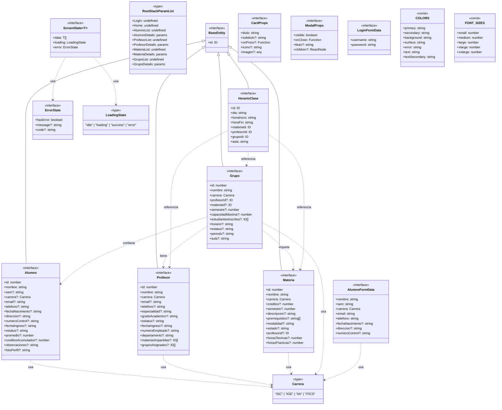

```mermaid
classDiagram
    %% Sistema de Tipos TypeScript
    %% Interfaces y Relaciones - React Native App
    
    class BaseEntity {
        <<interface>>
        +id: ID
    }
    
    class Alumno {
        <<interface>>
        +id: number
        +nombre: string
        +sem?: string
        +carrera?: Carrera
        +email?: string
        +telefono?: string
        +fechaNacimiento?: string
        +direccion?: string
        +numeroControl?: string
        +fechaIngreso?: string
        +estatus?: string
        +promedio?: number
        +creditosAcumulados?: number
        +observaciones?: string
        +fotoPerfil?: string
    }
    
    class Profesor {
        <<interface>>
        +id: number
        +nombre: string
        +carrera: Carrera
        +email?: string
        +telefono?: string
        +especialidad?: string
        +gradoAcademico?: string
        +estatus?: string
        +fechaIngreso?: string
        +numeroEmpleado?: string
        +departamento?: string
        +materiasImpartidas?: ID[]
        +gruposAsignados?: ID[]
    }
    
    class Materia {
        <<interface>>
        +id: number
        +nombre: string
        +carrera: Carrera
        +creditos?: number
        +semestre?: number
        +descripcion?: string
        +prerrequisitos?: string[]
        +modalidad?: string
        +estado?: string
        +profesorId?: ID
        +horasTeoricas?: number
        +horasPracticas?: number
    }
    
    class Grupo {
        <<interface>>
        +id: number
        +nombre: string
        +carrera: Carrera
        +profesorId?: ID
        +materiaId?: ID
        +semestre?: number
        +capacidadMaxima?: number
        +estudiantesInscritos?: ID[]
        +horario?: string
        +estatus?: string
        +periodo?: string
        +aula?: string
    }
    
    class HorarioClase {
        <<interface>>
        +id: ID
        +dia: string
        +horaInicio: string
        +horaFin: string
        +materiaId: ID
        +profesorId: ID
        +grupoId: ID
        +aula: string
    }
    
    class RootStackParamList {
        <<type>>
        +Login: undefined
        +Home: undefined
        +AlumnoList: undefined
        +AlumnoDetails: params
        +ProfesorList: undefined
        +ProfesorDetails: params
        +MateriaList: undefined
        +MateriaDetails: params
        +GrupoList: undefined
        +GrupoDetails: params
    }
    
    class ScreenState~T~ {
        <<interface>>
        +data: T[]
        +loading: LoadingState
        +error: ErrorState
    }
    
    class ErrorState {
        <<interface>>
        +hasError: boolean
        +message?: string
        +code?: string
    }
    
    class LoadingState {
        <<type>>
        "idle" | "loading" | "success" | "error"
    }
    
    class CardProps {
        <<interface>>
        +titulo: string
        +subtitulo?: string
        +onPress?: Function
        +icono?: string
        +imagen?: any
    }
    
    class ModalProps {
        <<interface>>
        +visible: boolean
        +onClose: Function
        +titulo?: string
        +children?: ReactNode
    }
    
    class LoginFormData {
        <<interface>>
        +username: string
        +password: string
    }
    
    class AlumnoFormData {
        <<interface>>
        +nombre: string
        +sem: string
        +carrera: Carrera
        +email: string
        +telefono: string
        +fechaNacimiento?: string
        +direccion?: string
        +numeroControl?: string
    }
    
    class Carrera {
        <<type>>
        "ISC" | "IGE" | "IIA" | "ITICS"
    }
    
    class COLORS {
        <<const>>
        +primary: string
        +secondary: string
        +background: string
        +surface: string
        +error: string
        +text: string
        +textSecondary: string
    }
    
    class FONT_SIZES {
        <<const>>
        +small: number
        +medium: number
        +large: number
        +xlarge: number
        +xxlarge: number
    }
    
    %% Relaciones de herencia
    BaseEntity <|-- Alumno
    BaseEntity <|-- Profesor
    BaseEntity <|-- Materia
    BaseEntity <|-- Grupo
    BaseEntity <|-- HorarioClase
    
    %% Relaciones de composición
    Alumno ..> Carrera : usa
    Profesor ..> Carrera : usa
    Materia ..> Carrera : usa
    Grupo ..> Carrera : usa
    
    Grupo ..> Alumno : contiene
    Grupo ..> Profesor : tiene
    Grupo ..> Materia : imparte
    
    HorarioClase ..> Materia : referencia
    HorarioClase ..> Profesor : referencia
    HorarioClase ..> Grupo : referencia
    
    ScreenState ..> ErrorState : usa
    ScreenState ..> LoadingState : usa
    
    %% Relaciones de uso en componentes
    AlumnoFormData ..> Carrera : usa
```
