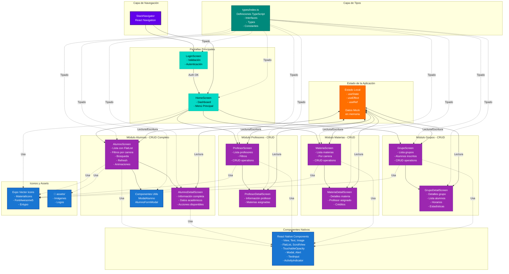

```mermaid
graph TB
    %% Flujo de Datos y Componentes
    %% Arquitectura de la Aplicación React Native
    
    subgraph "Capa de Navegación"
        Nav[StackNavigator<br/>React Navigation]
    end
    
    subgraph "Capa de Tipos"
        Types[types/index.ts<br/>Definiciones TypeScript<br/>- Interfaces<br/>- Types<br/>- Constantes]
    end
    
    subgraph "Pantallas Principales"
        Login[LoginScreen<br/>- Validación<br/>- Autenticación]
        Home[HomeScreen<br/>- Dashboard<br/>- Menú Principal]
    end
    
    subgraph "Módulo Alumnos - CRUD Completo"
        AlumnoList[AlumnoScreen<br/>- Lista con FlatList<br/>- Filtros por carrera<br/>- Búsqueda<br/>- Refresh<br/>- Animaciones]
        
        AlumnoDetail[AlumnoDetailScreen<br/>- Información completa<br/>- Datos académicos<br/>- Acciones disponibles]
        
        AlumnoUtils[Componentes Utils<br/>ModalAlumno<br/>AlumnoFormModal]
    end
    
    subgraph "Módulo Profesores - CRUD"
        ProfesorList[ProfesorScreen<br/>- Lista profesores<br/>- Filtros<br/>- CRUD operations]
        
        ProfesorDetail[ProfesorDetailScreen<br/>- Información profesor<br/>- Materias asignadas]
    end
    
    subgraph "Módulo Materias - CRUD"
        MateriaList[MateriaScreen<br/>- Lista materias<br/>- Por carrera<br/>- CRUD operations]
        
        MateriaDetail[MateriaDetailScreen<br/>- Detalles materia<br/>- Profesor asignado<br/>- Créditos]
    end
    
    subgraph "Módulo Grupos - CRUD"
        GrupoList[GrupoScreen<br/>- Lista grupos<br/>- Alumnos inscritos<br/>- CRUD operations]
        
        GrupoDetail[GrupoDetailScreen<br/>- Detalles grupo<br/>- Lista alumnos<br/>- Horarios<br/>- Estadísticas]
    end
    
    subgraph "Estado de la Aplicación"
        State[Estado Local<br/>- useState<br/>- useEffect<br/>- useRef<br/><br/>Datos Mock<br/>en memoria]
    end
    
    subgraph "Componentes Nativos"
        RNComponents[React Native Components<br/>- View, Text, Image<br/>- FlatList, ScrollView<br/>- TouchableOpacity<br/>- Modal, Alert<br/>- TextInput<br/>- ActivityIndicator]
    end
    
    subgraph "Iconos y Assets"
        Icons[Expo Vector Icons<br/>- MaterialIcons<br/>- FontAwesome5<br/>- Entypo]
        
        Assets[📁 assets/<br/>- Imágenes<br/>- Logos]
    end
    
    %% Flujo de navegación
    Nav --> Login
    Login -->|Auth OK| Home
    Nav --> Home
    
    Home --> AlumnoList
    Home --> ProfesorList
    Home --> MateriaList
    Home --> GrupoList
    
    AlumnoList --> AlumnoDetail
    AlumnoList --> AlumnoUtils
    
    ProfesorList --> ProfesorDetail
    MateriaList --> MateriaDetail
    GrupoList --> GrupoDetail
    
    %% Flujo de tipos
    Types -.->|Tipado| Login
    Types -.->|Tipado| Home
    Types -.->|Tipado| AlumnoList
    Types -.->|Tipado| AlumnoDetail
    Types -.->|Tipado| AlumnoUtils
    Types -.->|Tipado| ProfesorList
    Types -.->|Tipado| ProfesorDetail
    Types -.->|Tipado| MateriaList
    Types -.->|Tipado| MateriaDetail
    Types -.->|Tipado| GrupoList
    Types -.->|Tipado| GrupoDetail
    
    %% Flujo de estado
    State <-->|Lectura/Escritura| AlumnoList
    State <-->|Lectura/Escritura| ProfesorList
    State <-->|Lectura/Escritura| MateriaList
    State <-->|Lectura/Escritura| GrupoList
    
    State <-->|Lectura| AlumnoDetail
    State <-->|Lectura| ProfesorDetail
    State <-->|Lectura| MateriaDetail
    State <-->|Lectura| GrupoDetail
    
    %% Uso de componentes
    AlumnoList -.->|Usa| RNComponents
    AlumnoDetail -.->|Usa| RNComponents
    ProfesorList -.->|Usa| RNComponents
    MateriaList -.->|Usa| RNComponents
    GrupoList -.->|Usa| RNComponents
    
    %% Uso de iconos y assets
    AlumnoList -.->|Usa| Icons
    AlumnoList -.->|Usa| Assets
    ProfesorList -.->|Usa| Icons
    MateriaList -.->|Usa| Icons
    GrupoList -.->|Usa| Icons
    Home -.->|Usa| Icons
    
    %% Estilos
    classDef navClass fill:#6200ea,stroke:#4a148c,color:#fff,stroke-width:3px
    classDef screenClass fill:#03dac6,stroke:#00bfa5,color:#000,stroke-width:2px
    classDef moduleClass fill:#9c27b0,stroke:#7b1fa2,color:#fff,stroke-width:2px
    classDef stateClass fill:#ff6f00,stroke:#e65100,color:#fff,stroke-width:2px
    classDef typeClass fill:#00897b,stroke:#00695c,color:#fff,stroke-width:2px
    classDef utilClass fill:#1976d2,stroke:#0d47a1,color:#fff,stroke-width:2px
    
    class Nav navClass
    class Login,Home screenClass
    class AlumnoList,AlumnoDetail,ProfesorList,ProfesorDetail,MateriaList,MateriaDetail,GrupoList,GrupoDetail moduleClass
    class State stateClass
    class Types typeClass
    class RNComponents,Icons,Assets,AlumnoUtils utilClass
```
