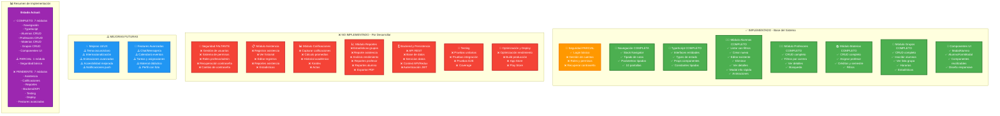

```mermaid
graph TB
    %% Estado de Implementación de Funcionalidades
    %% Sistema de Gestión Escolar
    
    subgraph "✅ IMPLEMENTADO - Base del Sistema"
        direction TB
        
        Seg1[🔐 Seguridad PARCIAL<br/>✅ Login básico<br/>❌ Gestión de cuentas<br/>❌ Roles y permisos<br/>❌ Recuperar contraseña]
        
        Nav[🧭 Navegación COMPLETA<br/>✅ Stack Navigator<br/>✅ Tipado de rutas<br/>✅ Parámetros tipados<br/>✅ 10 pantallas]
        
        Types[📘 TypeScript COMPLETO<br/>✅ Interfaces entidades<br/>✅ Types de estado<br/>✅ Props componentes<br/>✅ Constantes tipadas]
        
        Alum[👨‍🎓 Módulo Alumnos COMPLETO<br/>✅ Listar con filtros<br/>✅ Crear nuevo<br/>✅ Editar existente<br/>✅ Eliminar<br/>✅ Ver detalles<br/>✅ Modal info rápida<br/>✅ Animaciones]
        
        Prof[👨‍🏫 Módulo Profesores COMPLETO<br/>✅ CRUD completo<br/>✅ Filtros por carrera<br/>✅ Ver detalles<br/>✅ Búsqueda]
        
        Mat[📚 Módulo Materias COMPLETO<br/>✅ CRUD completo<br/>✅ Asignar profesor<br/>✅ Créditos y semestre<br/>✅ Filtros]
        
        Grup[👥 Módulo Grupos COMPLETO<br/>✅ CRUD completo<br/>✅ Inscribir alumnos<br/>✅ Ver lista grupo<br/>✅ Horarios<br/>✅ Estadísticas]
        
        UI[🎨 Componentes UI<br/>✅ ModalAlumno<br/>✅ AlumnoFormModal<br/>✅ Componentes reutilizables<br/>✅ Diseño responsive]
    end
    
    subgraph "❌ NO IMPLEMENTADO - Por Desarrollar"
        direction TB
        
        Seg2[🔐 Seguridad FALTANTE<br/>❌ Gestión de usuarios<br/>❌ Sistema de permisos<br/>❌ Roles profesor/admin<br/>❌ Recuperación contraseña<br/>❌ Cambio de contraseña]
        
        Asist[📋 Módulo Asistencia<br/>❌ Registrar asistencia<br/>❌ Ver historial<br/>❌ Editar registros<br/>❌ Reportes asistencia<br/>❌ Estadísticas]
        
        Calif[📊 Módulo Calificaciones<br/>❌ Capturar calificaciones<br/>❌ Cálculo promedios<br/>❌ Historial académico<br/>❌ Kardex<br/>❌ Actas]
        
        Report[📈 Módulo Reportes<br/>❌ Estadísticas grupos<br/>❌ Reporte asistencia<br/>❌ Análisis rendimiento<br/>❌ Reportes profesor<br/>❌ Reportes alumno<br/>❌ Exportar PDF]
        
        Backend[🗄️ Backend y Persistencia<br/>❌ API REST<br/>❌ Base de datos<br/>❌ Servicios datos<br/>❌ Context API/Redux<br/>❌ Autenticación JWT]
        
        Test[🧪 Testing<br/>❌ Pruebas unitarias<br/>❌ Pruebas integración<br/>❌ Pruebas E2E<br/>❌ Coverage]
        
        Deploy[🚀 Optimización y Deploy<br/>❌ Optimización rendimiento<br/>❌ Build producción<br/>❌ App Store<br/>❌ Play Store]
    end
    
    subgraph "⚠️ MEJORAS FUTURAS"
        direction TB
        
        UX[✨ Mejoras UI/UX<br/>⚠️ Tema oscuro/claro<br/>⚠️ Internacionalización<br/>⚠️ Animaciones avanzadas<br/>⚠️ Accesibilidad mejorada<br/>⚠️ Notificaciones push]
        
        Features[🎯 Features Avanzadas<br/>⚠️ Chat/Mensajería<br/>⚠️ Calendario eventos<br/>⚠️ Tareas y asignaciones<br/>⚠️ Material didáctico<br/>⚠️ Perfil con foto]
    end
    
    %% Leyenda y contadores
    subgraph "📊 Resumen de Implementación"
        Stats[<b>Estado Actual:</b><br/><br/>✅ COMPLETO: 7 módulos<br/>- Navegación<br/>- TypeScript<br/>- Alumnos CRUD<br/>- Profesores CRUD<br/>- Materias CRUD<br/>- Grupos CRUD<br/>- Componentes UI<br/><br/>⚠️ PARCIAL: 1 módulo<br/>- Seguridad básica<br/><br/>❌ PENDIENTE: 7 módulos<br/>- Asistencia<br/>- Calificaciones<br/>- Reportes<br/>- Backend/API<br/>- Testing<br/>- Deploy<br/>- Features avanzadas]
    end
    
    %% Estilos
    classDef implementado fill:#4caf50,stroke:#2e7d32,color:#fff,stroke-width:3px
    classDef pendiente fill:#f44336,stroke:#c62828,color:#fff,stroke-width:3px
    classDef parcial fill:#ff9800,stroke:#f57c00,color:#fff,stroke-width:3px
    classDef mejoras fill:#2196f3,stroke:#1565c0,color:#fff,stroke-width:2px
    classDef stats fill:#9c27b0,stroke:#6a1b9a,color:#fff,stroke-width:3px
    
    class Nav,Types,Alum,Prof,Mat,Grup,UI implementado
    class Seg1 parcial
    class Seg2,Asist,Calif,Report,Backend,Test,Deploy pendiente
    class UX,Features mejoras
    class Stats stats
```
