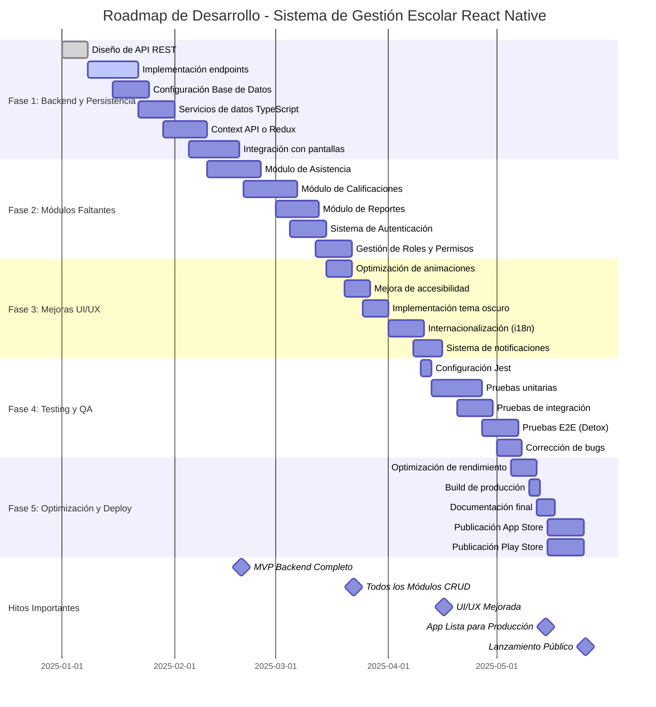

```mermaid
gantt
    title Roadmap de Desarrollo - Sistema de Gestión Escolar React Native
    dateFormat  YYYY-MM-DD
    
    section Fase 1: Backend y Persistencia
    Diseño de API REST           :done, api1, 2025-01-01, 7d
    Implementación endpoints      :active, api2, 2025-01-08, 14d
    Configuración Base de Datos   :api3, 2025-01-15, 10d
    Servicios de datos TypeScript :api4, 2025-01-22, 10d
    Context API o Redux          :api5, 2025-01-29, 12d
    Integración con pantallas    :api6, 2025-02-05, 14d
    
    section Fase 2: Módulos Faltantes
    Módulo de Asistencia         :mod1, 2025-02-10, 15d
    Módulo de Calificaciones     :mod2, 2025-02-20, 15d
    Módulo de Reportes           :mod3, 2025-03-01, 12d
    Sistema de Autenticación     :mod4, 2025-03-05, 10d
    Gestión de Roles y Permisos  :mod5, 2025-03-12, 10d
    
    section Fase 3: Mejoras UI/UX
    Optimización de animaciones  :ux1, 2025-03-15, 7d
    Mejora de accesibilidad      :ux2, 2025-03-20, 7d
    Implementación tema oscuro   :ux3, 2025-03-25, 7d
    Internacionalización (i18n)  :ux4, 2025-04-01, 10d
    Sistema de notificaciones    :ux5, 2025-04-08, 8d
    
    section Fase 4: Testing y QA
    Configuración Jest           :test1, 2025-04-10, 3d
    Pruebas unitarias            :test2, 2025-04-13, 14d
    Pruebas de integración       :test3, 2025-04-20, 10d
    Pruebas E2E (Detox)          :test4, 2025-04-27, 10d
    Corrección de bugs           :test5, 2025-05-01, 7d
    
    section Fase 5: Optimización y Deploy
    Optimización de rendimiento  :deploy1, 2025-05-05, 7d
    Build de producción          :deploy2, 2025-05-10, 3d
    Documentación final          :deploy3, 2025-05-12, 5d
    Publicación App Store        :deploy4, 2025-05-15, 10d
    Publicación Play Store       :deploy5, 2025-05-15, 10d
    
    section Hitos Importantes
    MVP Backend Completo         :milestone, m1, 2025-02-19, 1d
    Todos los Módulos CRUD       :milestone, m2, 2025-03-22, 1d
    UI/UX Mejorada               :milestone, m3, 2025-04-16, 1d
    App Lista para Producción    :milestone, m4, 2025-05-14, 1d
    Lanzamiento Público          :milestone, m5, 2025-05-25, 1d
```
