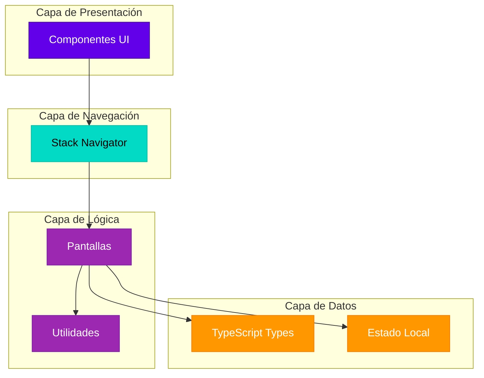
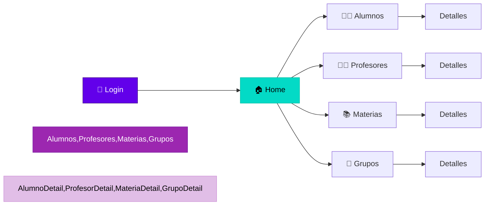

# 📱 Sistema de Gestión Escolar - React Native TypeScript

> Aplicación móvil para la gestión integral de instituciones educativas, desarrollada con React Native, TypeScript y Expo.

[](https://www.typescriptlang.org/)
[](https://reactnative.dev/)
[](https://expo.dev/)

---

## 📋 Tabla de Contenidos

- [Características](#-características)
- [Arquitectura](#-arquitectura)
- [Instalación](#-instalación)
- [Uso](#-uso)
- [Módulos](#-módulos)
- [Diagramas](#-diagramas)
- [Tecnologías](#-tecnologías)
- [Estructura del Proyecto](#-estructura-del-proyecto)
- [Roadmap](#-roadmap)
- [Contribuir](#-contribuir)
- [Licencia](#-licencia)

---

## ✨ Características

### Implementadas ✅
- 🔐 **Autenticación** - Sistema de login seguro
- 👨‍🎓 **Gestión de Alumnos** - CRUD completo con filtros y búsqueda
- 👨‍🏫 **Gestión de Profesores** - Administración de docentes
- 📚 **Gestión de Materias** - Control de asignaturas por carrera
- 👥 **Gestión de Grupos** - Administración de grupos académicos
- 📱 **UI Responsive** - Diseño adaptable a diferentes dispositivos
- 🎨 **Componentes Reutilizables** - Modales y formularios compartidos
- 💾 **TypeScript** - Tipado estático completo

### En Desarrollo 🚧
- 📋 **Módulo de Asistencia** - Registro y control de asistencias
- 📊 **Módulo de Calificaciones** - Captura y gestión de notas
- 📈 **Módulo de Reportes** - Estadísticas y análisis
- 🔄 **Backend API** - Integración con servidor
- 🗄️ **Base de Datos** - Persistencia real de datos

---

## 🏗️ Arquitectura

La aplicación sigue una arquitectura modular con separación clara de responsabilidades:



### Flujo de Navegación



---

## 🚀 Instalación

### Prerequisitos
- Node.js (v16 o superior)
- npm o yarn
- Expo CLI
- iOS Simulator o Android Emulator (opcional)

### Pasos de Instalación

1. **Clonar el repositorio**
```bash
git clone https://github.com/tu-usuario/gestion-escolar-app.git
cd gestion-escolar-app
```

2. **Instalar dependencias**
```bash
npm install
# o
yarn install
```

3. **Iniciar el proyecto**
```bash
npm start
# o
yarn start
```

4. **Ejecutar en dispositivo**
- Escanea el código QR con la app Expo Go (Android/iOS)
- Presiona `a` para Android emulator
- Presiona `i` para iOS simulator

---

## 💻 Uso

### Iniciar Sesión
1. Abre la aplicación
2. Ingresa tus credenciales (actualmente cualquier usuario/contraseña es válido)
3. Accede al dashboard principal

### Gestionar Alumnos
1. Desde el Home, selecciona "Alumnos"
2. Ver lista de alumnos
3. Agregar nuevo alumno con el botón "+"
4. Editar o eliminar alumnos existentes
5. Ver detalles completos de cada alumno

### Gestionar Profesores
Similar al flujo de alumnos, con opciones para:
- Ver lista de profesores
- Agregar, editar, eliminar
- Ver detalles y materias asignadas

### Gestionar Materias
- Crear nuevas materias
- Asignar profesores
- Definir créditos y semestre
- Filtrar por carrera

### Gestionar Grupos
- Crear grupos académicos
- Inscribir alumnos
- Asignar horarios
- Ver estadísticas del grupo

---

## 📦 Módulos

### Módulo de Alumnos 👨‍🎓
**Estado:** ✅ Completo

Funcionalidades:
- Listar alumnos con FlatList optimizado
- Filtros por carrera y semestre
- Búsqueda por nombre
- CRUD completo (Crear, Leer, Actualizar, Eliminar)
- Vista de detalles con información académica
- Modal de información rápida
- Formulario de edición con validación
- Animaciones de entrada/salida
- Pull to refresh

### Módulo de Profesores 👨‍🏫
**Estado:** ✅ Completo

Funcionalidades:
- Lista de profesores
- Filtros por carrera
- CRUD completo
- Vista de detalles
- Materias impartidas
- Búsqueda

### Módulo de Materias 📚
**Estado:** ✅ Completo

Funcionalidades:
- Lista de materias
- Filtros por carrera
- CRUD completo
- Asignación de profesores
- Gestión de créditos
- Prerequisitos

### Módulo de Grupos 👥
**Estado:** ✅ Completo

Funcionalidades:
- Lista de grupos activos
- CRUD completo
- Inscripción de alumnos
- Vista de lista del grupo
- Gestión de horarios
- Estadísticas del grupo

### Módulo de Asistencia 📋
**Estado:** 🚧 En desarrollo

Próximamente:
- Registro de asistencia por sesión
- Historial de asistencias
- Reportes de asistencia
- Justificación de faltas

### Módulo de Calificaciones 📊
**Estado:** 🚧 En desarrollo

Próximamente:
- Captura de calificaciones
- Cálculo de promedios
- Historial académico
- Kardex del alumno

---

## 📊 Diagramas

### Diagrama de Componentes Completo

Para ver todos los diagramas detallados, consulta:
- [📄 Resumen Completo](./docs/0_RESUMEN_COMPLETO.md)
- [🔀 Diagrama de Navegación](./docs/1_Diagrama_Navegacion.md)
- [📁 Estructura de Archivos](./docs/2_Diagrama_Estructura_Archivos.md)
- [📘 Tipos TypeScript](./docs/3_Diagrama_Tipos_TypeScript.md)
- [🔄 Flujo de Datos](./docs/4_Diagrama_Flujo_Datos.md)
- [✅ Estado de Implementación](./docs/5_Diagrama_Estado_Implementacion.md)
- [🗓️ Roadmap](./docs/6_Diagrama_Roadmap_Gantt.md)

---

## 🛠️ Tecnologías

### Core
- **React Native** `0.76.x` - Framework principal
- **TypeScript** `5.x` - Lenguaje de programación
- **Expo** `~52.0.0` - Plataforma de desarrollo

### Navegación
- **React Navigation** `6.x` - Navegación entre pantallas
- **@react-navigation/stack** - Stack Navigator

### UI/UX
- **Expo Vector Icons** - Iconografía
  - MaterialIcons
  - FontAwesome5
  - Entypo
- **Animated API** - Animaciones nativas

### Herramientas de Desarrollo
- **ESLint** - Linting de código
- **Prettier** - Formateo de código
- **TypeScript Compiler** - Verificación de tipos

---

## 📂 Estructura del Proyecto

```
gestion-escolar-app/
├── App.tsx                          # Punto de entrada
├── app.json                         # Configuración de Expo
├── package.json                     # Dependencias
├── tsconfig.json                    # Configuración TypeScript
│
├── src/
│   ├── navigation/
│   │   └── StackNavigator.tsx      # Configuración de rutas
│   │
│   ├── screens/
│   │   ├── auth/
│   │   │   └── LoginScreen.tsx
│   │   ├── home/
│   │   │   └── HomeScreen.tsx
│   │   ├── alumnos/
│   │   │   ├── AlumnoScreen.tsx
│   │   │   └── AlumnoDetailScreen.tsx
│   │   ├── profesores/
│   │   │   ├── ProfesorScreen.tsx
│   │   │   └── ProfesorDetailScreen.tsx
│   │   ├── materias/
│   │   │   ├── MateriaScreen.tsx
│   │   │   └── MateriaDetailScreen.tsx
│   │   └── grupos/
│   │       ├── GrupoScreen.tsx
│   │       └── GrupoDetailScreen.tsx
│   │
│   └── utils/
│       ├── ModalAlumno.tsx
│       └── AlumnoFormModal.tsx
│
├── types/
│   └── index.ts                     # Definiciones TypeScript
│
├── assets/
│   ├── alumno_image1.png
│   ├── profesor_image1.png
│   ├── materia_image.png
│   ├── grupo_image.png
│   ├── logoApp.png
│   └── login_image.png
│
└── docs/
    └── [diagramas y documentación]
```

---

## 🗓️ Roadmap

### Q1 2025 ✅ (Completado)
- [x] Configuración inicial del proyecto
- [x] Sistema de navegación
- [x] Definición de tipos TypeScript
- [x] Módulo de Alumnos
- [x] Módulo de Profesores
- [x] Módulo de Materias
- [x] Módulo de Grupos
- [x] Componentes reutilizables

### Q2 2025 🚧 (En Progreso)
- [ ] Implementación de Backend API
- [ ] Configuración de Base de Datos
- [ ] Módulo de Asistencia
- [ ] Módulo de Calificaciones
- [ ] Módulo de Reportes

### Q3 2025 📅 (Planificado)
- [ ] Sistema completo de autenticación
- [ ] Gestión de roles y permisos
- [ ] Mejoras de UI/UX
- [ ] Tema oscuro/claro
- [ ] Internacionalización

### Q4 2025 📅 (Planificado)
- [ ] Testing automatizado
- [ ] Optimización de rendimiento
- [ ] Documentación completa
- [ ] Publicación en App Store
- [ ] Publicación en Play Store

---

## 🤝 Contribuir

Las contribuciones son bienvenidas! Para contribuir:

1. Fork el proyecto
2. Crea una rama para tu feature (`git checkout -b feature/AmazingFeature`)
3. Commit tus cambios (`git commit -m 'Add: nueva funcionalidad'`)
4. Push a la rama (`git push origin feature/AmazingFeature`)
5. Abre un Pull Request

### Guías de Contribución
- Sigue las convenciones de código TypeScript
- Documenta nuevas funcionalidades
- Actualiza los diagramas si modificas la arquitectura
- Agrega pruebas para nuevas funcionalidades
- Sigue el estilo de commits: `Add:`, `Fix:`, `Update:`, `Remove:`

---

## 📄 Licencia

Este proyecto está bajo la Licencia MIT. Ver el archivo `LICENSE` para más detalles.

---

## 👥 Autores

**Equipo de Desarrollo**
- Programación Móvil - ITSZ

---

## 📞 Contacto

- **Email:** contacto@proyecto.edu
- **Website:** https://proyecto.edu
- **GitHub:** https://github.com/tu-usuario/gestion-escolar-app

---

## 🙏 Agradecimientos

- A la comunidad de React Native
- Al equipo de Expo
- A todos los contribuidores del proyecto

---

<p align="center">
  Hecho con ❤️ para la educación
</p>

<p align="center">
  
</p>
