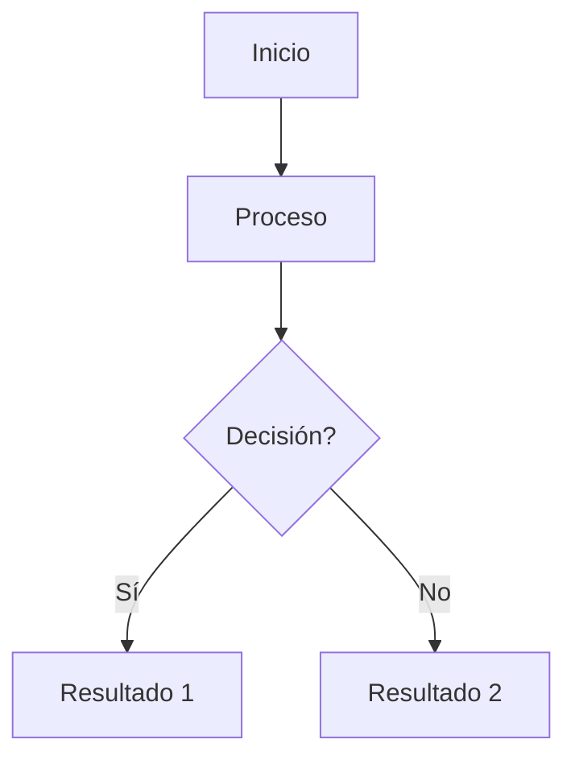
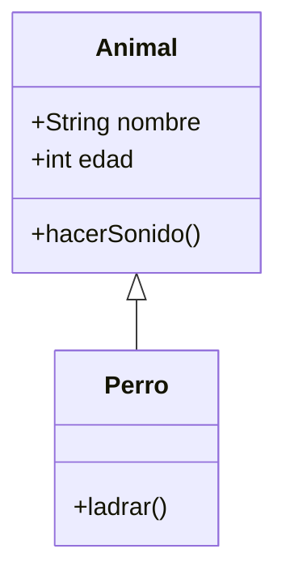
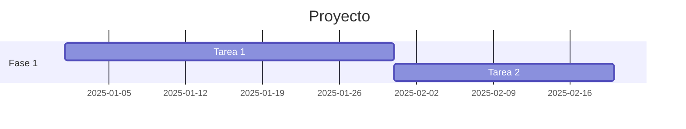
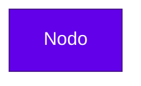
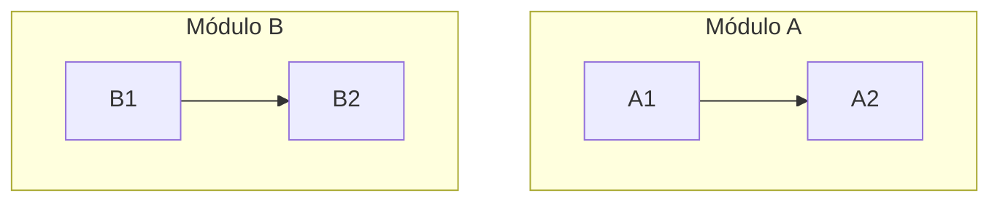
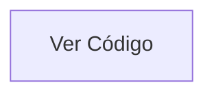

# 📖 Guía de Uso de los Diagramas Mermaid

## 🎯 Archivos Generados

He creado **7 archivos** con diagramas completos de la aplicación:

1. **0_RESUMEN_COMPLETO.md** - Documento maestro con toda la información
2. **1_Diagrama_Navegacion.md** - Flujo de navegación entre pantallas
3. **2_Diagrama_Estructura_Archivos.md** - Organización de carpetas y archivos
4. **3_Diagrama_Tipos_TypeScript.md** - Sistema de interfaces y tipos
5. **4_Diagrama_Flujo_Datos.md** - Arquitectura de componentes y datos
6. **5_Diagrama_Estado_Implementacion.md** - Funcionalidades completadas vs pendientes
7. **6_Diagrama_Roadmap_Gantt.md** - Plan de desarrollo temporal

---

## 🖥️ Formas de Visualizar los Diagramas

### Opción 1: GitHub/GitLab (Recomendado)
1. Crear un repositorio en GitHub o GitLab
2. Subir los archivos .md
3. Los diagramas se visualizarán automáticamente

### Opción 2: Mermaid Live Editor (Online)
1. Ir a https://mermaid.live
2. Copiar el código del diagrama (entre \`\`\`mermaid y \`\`\`)
3. Pegarlo en el editor
4. Ver el diagrama renderizado en tiempo real
5. **Exportar** como PNG, SVG o copiar el enlace

### Opción 3: VS Code (Editor)
1. Instalar extensión "Mermaid Preview" o "Markdown Preview Mermaid Support"
2. Abrir el archivo .md
3. Presionar `Ctrl+Shift+V` (o `Cmd+Shift+V` en Mac)
4. Ver el diagrama renderizado en la vista previa

### Opción 4: Notion
1. Crear una página en Notion
2. Escribir `/code`
3. Seleccionar "Mermaid"
4. Pegar el código del diagrama

### Opción 5: Obsidian
1. Activar el plugin "Mermaid" en configuración
2. Crear una nota nueva
3. Insertar el código entre \`\`\`mermaid y \`\`\`
4. El diagrama se renderiza automáticamente

### Opción 6: Documentación con MkDocs
1. Instalar MkDocs con plugin mermaid: `pip install mkdocs-mermaid2-plugin`
2. Agregar los archivos .md a la documentación
3. Los diagramas se renderizan en la documentación HTML

---

## 📝 Cómo Editar los Diagramas

### Sintaxis Básica de Mermaid

#### Graph (Flujo)


#### Class Diagram (Clases)


#### Gantt (Cronograma)


### Modificar Elementos

#### Cambiar texto de un nodo:
```
A[Nuevo Texto]
```

#### Cambiar colores:
```
classDef miEstilo fill:#ff0000,stroke:#000,color:#fff
class A miEstilo
```

#### Agregar nuevas conexiones:
```
A --> B
B --> C
```

---

## 🎨 Personalización de Estilos

### Colores del Proyecto Actual
```
- Primary: #6200ea (morado)
- Secondary: #03dac6 (cyan)
- Success: #4caf50 (verde)
- Error: #f44336 (rojo)
- Warning: #ff9800 (naranja)
- Info: #2196f3 (azul)
```

### Aplicar estilos personalizados:


---

## 📤 Exportar Diagramas

### Desde Mermaid Live:
1. Ir a https://mermaid.live
2. Pegar el código
3. Click en "Actions" → "Export"
4. Elegir formato:
   - **PNG** (para documentos, presentaciones)
   - **SVG** (para web, escalable)
   - **PDF** (para imprimir)

### Desde VS Code:
1. Instalar "Mermaid Editor"
2. Click derecho en el diagrama
3. "Export to PNG/SVG"

---

## 🔧 Integración en Proyectos

### En README.md del Proyecto:
```markdown
# Sistema de Gestión Escolar

## Arquitectura

\`\`\`mermaid
graph TD
    Login[LoginScreen] --> Home[HomeScreen]
    Home --> Alumnos[Módulo Alumnos]
    Home --> Profesores[Módulo Profesores]
\`\`\`
```

### En Documentación Técnica:
- Agregar los archivos .md a la carpeta `/docs`
- Crear un índice que enlace a cada diagrama
- Usar en conjunto con código de ejemplo

### En Presentaciones:
1. Exportar diagramas como PNG de alta resolución
2. Insertar en PowerPoint, Google Slides, etc.
3. Agregar anotaciones si es necesario

---

## 🎓 Uso Académico

### Para Estudiantes:
- **Estudiar la arquitectura** antes de modificar código
- **Documentar cambios** actualizando los diagramas
- **Presentaciones** de avance del proyecto
- **Entregables** como parte de la documentación

### Para Profesores:
- **Material didáctico** para explicar arquitectura
- **Evaluación** de comprensión de la estructura
- **Comparación** entre diferentes equipos
- **Base** para definir nuevas actividades

---

## 📋 Checklist de Actualización

Cuando agregues nuevas funcionalidades, actualiza:

- [ ] Diagrama de Navegación (si agregaste pantallas)
- [ ] Diagrama de Estructura de Archivos (si creaste carpetas/archivos)
- [ ] Diagrama de Tipos TypeScript (si agregaste interfaces)
- [ ] Diagrama de Flujo de Datos (si cambiaste arquitectura)
- [ ] Diagrama de Estado de Implementación (si completaste módulos)
- [ ] Diagrama de Roadmap (si cambió el plan)
- [ ] Resumen Completo (actualiza estadísticas)

---

## 🌐 Recursos Adicionales

### Documentación Oficial:
- https://mermaid.js.org - Documentación completa
- https://mermaid.live - Editor online
- https://github.com/mermaid-js/mermaid - Repositorio

### Tutoriales:
- https://mermaid.js.org/intro/ - Guía de inicio
- https://www.youtube.com/results?search_query=mermaid+diagram+tutorial

### Ejemplos:
- https://github.com/mermaid-js/mermaid/tree/develop/demos

---

## ⚡ Tips y Trucos

### 1. Simplificar diagramas complejos
Si un diagrama es muy grande, dividirlo en varios más pequeños:
- Diagrama general de alto nivel
- Diagramas detallados por módulo

### 2. Usar subgrafos
Agrupar elementos relacionados:


### 3. Comentarios en el código


### 4. Enlaces externos
Los diagramas en GitHub pueden enlazar a otros archivos:


---

## 🤝 Contribución

Para mantener los diagramas actualizados:

1. **Antes de hacer cambios grandes** en el código, actualiza el diagrama
2. **Después de implementar** una nueva funcionalidad, actualiza el diagrama de estado
3. **Usa nombres consistentes** entre código y diagramas
4. **Documenta decisiones** de arquitectura en los diagramas

---

## ❓ Preguntas Frecuentes

**Q: ¿Por qué Mermaid y no otras herramientas?**  
A: Mermaid es código, se versiona con Git, no requiere software adicional, y se renderiza automáticamente en GitHub/GitLab.

**Q: ¿Puedo editar los diagramas sin saber código?**  
A: Sí, usa https://mermaid.live - tiene una interfaz visual y preview en tiempo real.

**Q: ¿Los diagramas se actualizan automáticamente con el código?**  
A: No, debes actualizarlos manualmente. Considera esto parte de la documentación.

**Q: ¿Puedo usar estos diagramas en mi proyecto?**  
A: Sí, están diseñados para ser reutilizables. Modifícalos según tus necesidades.

**Q: ¿Qué hago si el diagrama es muy largo?**  
A: Divídelo en varios diagramas más pequeños, uno por funcionalidad o módulo.

---

## 📞 Soporte

Si tienes problemas visualizando los diagramas:
1. Verifica que el código esté entre \`\`\`mermaid y \`\`\`
2. Prueba en https://mermaid.live para validar la sintaxis
3. Revisa la documentación oficial: https://mermaid.js.org

---

**¡Éxito con tu proyecto React Native! 🚀**
