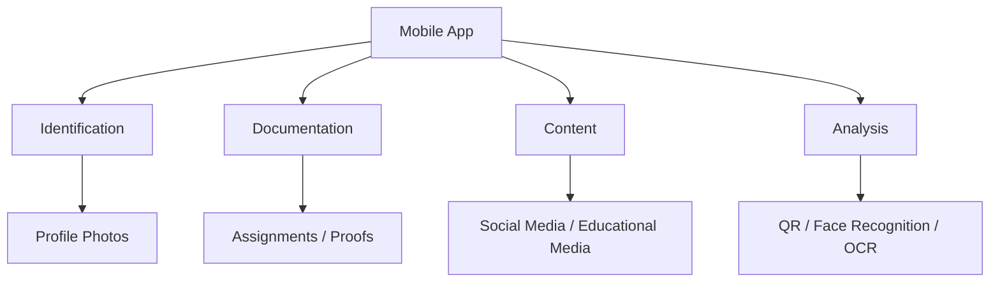
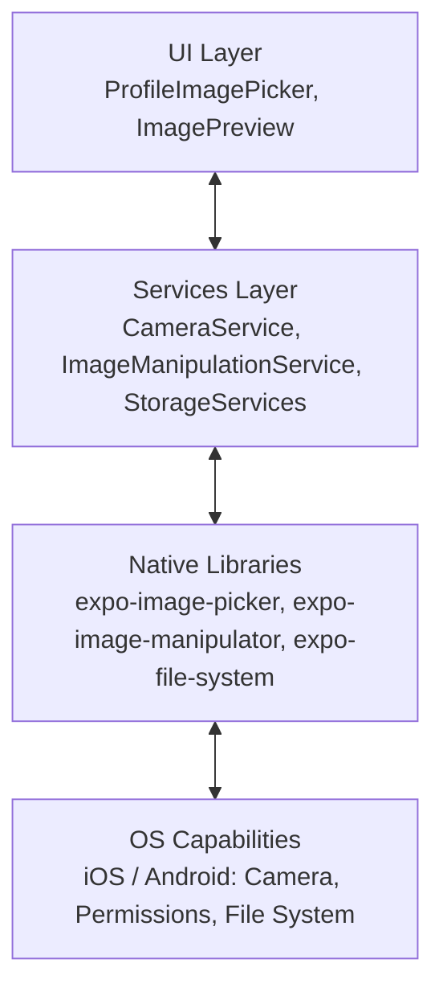
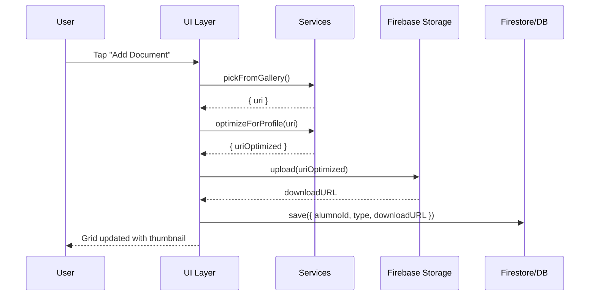

# Acceso a Cámara y Manipulación de Imágenes (React Native + Expo, TypeScript)

> README técnico para el **Tema 3.2**. Contiene arquitectura, implementación paso a paso, componentes reutilizables, optimización y recursos. Diagramas en **Mermaid (inglés técnico)** y código **comentado** en TypeScript.

---

## Tabla de Contenidos

- [1. Introducción y Contexto](#1-introducción-y-contexto)
- [2. Arquitectura General del Sistema de Imágenes](#2-arquitectura-general-del-sistema-de-imágenes)
- [3. Implementación de Servicios](#3-implementación-de-servicios)
  - [3.1 Tipos TypeScript](#31-tipos-typescript)
  - [3.2 PermissionsService](#32-permissionsservice)
  - [3.3 CameraService](#33-cameraservice)
  - [3.4 ImageManipulationService](#34-imagemanipulationservice)
  - [3.5 LocalStorageService](#35-localstorageservice)
  - [3.6 CloudStorageService (Firebase Storage)](#36-cloudstorageservice-firebase-storage)
- [4. Componentes Reutilizables](#4-componentes-reutilizables)
  - [4.1 ProfileImagePicker](#41-profileimagepicker)
  - [4.2 Integración en Formulario (AlumnoFormModal)](#42-integración-en-formulario-alumnoformmodal)
- [5. Optimización, Errores y Rendimiento](#5-optimización-errores-y-rendimiento)
  - [5.1 Estrategias de Optimización](#51-estrategias-de-optimización)
  - [5.2 Manejo de Errores Frecuentes](#52-manejo-de-errores-frecuentes)
  - [5.3 Caché y Performance](#53-caché-y-performance)
  - [5.4 Expo vs React Native CLI](#54-expo-vs-react-native-cli)
- [6. Ejercicio Práctico y Cierre](#6-ejercicio-práctico-y-cierre)
  - [6.1 Galería de Documentos del Alumno (reto guiado)](#61-galería-de-documentos-del-alumno-reto-guiado)
  - [6.2 Roadmap de Mejoras](#62-roadmap-de-mejoras)
  - [6.3 Recursos RecomENDADOS](#63-recursos-recomendados)

---

## 1. Introducción y Contexto

Las imágenes son un elemento transversal en apps móviles: **identificación**, **documentación**, **contenido** y **análisis**. En este tema aprenderás a **capturar**, **seleccionar**, **manipular** y **almacenar** imágenes con React Native y Expo.

**Objetivos:**

- Implementar acceso a **cámara** y **galería**.
- **Manipular** imágenes: redimensionar, comprimir, recortar.
- **Almacenar** imágenes localmente y en **Firebase Storage**.
- Integrar un **sistema de fotos de perfil** reutilizable.

**Casos de uso típicos:** credenciales, fotos de perfil, tareas con evidencias, lectura de QR/OCR.



---

## 2. Arquitectura General del Sistema de Imágenes

Arquitectura por **capas** para mantener **separación de responsabilidades** y **reutilización**.



**Comparativa de librerías (resumen):**

| Librería                   | Expo | RN CLI | Uso principal                     | Tamaño |
|---------------------------|:----:|:------:|-----------------------------------|:-----:|
| `expo-image-picker`       |  ✅  |   ❌   | Cámara y galería                  | Small |
| `react-native-image-picker` |  ⚠️ |   ✅   | Cámara/galería (sin Expo)         | Mid   |
| `expo-image-manipulator`  |  ✅  |   ❌   | Redimensionar, comprimir, crop    | Small |
| `expo-file-system`        |  ✅  |   ❌   | Guardado local, lectura de archivos | Small |

> **Decisión recomendada:** En proyectos educativos con Expo, usar **`expo-image-picker`** + **`expo-image-manipulator`** + **`expo-file-system`**.

---

## 3. Implementación de Servicios

### Pre-instalación

```bash
# Expo Image Picker
npx expo install expo-image-picker

# Manipulación de imágenes
npx expo install expo-image-manipulator

# Sistema de archivos
npx expo install expo-file-system

# (Opcional) Firebase Storage: si usas React Native Firebase
npm i @react-native-firebase/app @react-native-firebase/storage
```

> En `app.json`, agrega el plugin de permisos de fotos si es necesario.

### 3.1 Tipos TypeScript

Define tipos para mantener **seguridad y autocompletado**.

```ts
// types/images.ts
export interface ImagePickerOptions {
  mediaTypes?: 'Images' | 'Videos' | 'All'; // Qué tipos permite
  allowsEditing?: boolean;                  // Activar recorte en UI nativa
  aspect?: [number, number];                // Relación de aspecto (p.ej., [1,1] cuadrado)
  quality?: number;                         // 0-1 compresión JPEG
  base64?: boolean;                         // Incluir base64 (no recomendado por tamaño)
}

export interface ImagePickerResult {
  success: boolean;     // Éxito global
  uri?: string;         // Ruta local a la imagen
  base64?: string;      // Datos base64 (si se pidió)
  width?: number;
  height?: number;
  fileSize?: number;
  cancelled?: boolean;  // Usuario canceló
  error?: string;       // Mensaje de error
}

export interface ImageInfo {
  uri: string;
  width: number;
  height: number;
  format: 'jpeg' | 'png' | 'gif' | 'webp';
  fileSize?: number;
  exif?: any;           // Metadatos
  base64?: string;
}

export interface ManipulationOptions {
  resize?: { width: number; height: number }; // Redimensionar
  compress?: number;                           // 0-1
  format?: 'jpeg' | 'png';                     // Formato de salida
  crop?: { originX: number; originY: number; width: number; height: number };
}
```

---

### 3.2 `PermissionsService`

```ts
// src/services/camera/permissions.service.ts
import * as ImagePicker from 'expo-image-picker';

/**
 * Centraliza el manejo de permisos de cámara y galería.
 * Evita duplicación de código y facilita el testeo.
 */
export class PermissionsService {
  // Solicitar permiso de cámara
  static async requestCameraPermission(): Promise<boolean> {
    const { status } = await ImagePicker.requestCameraPermissionsAsync();
    return status === 'granted';
  }

  // Solicitar permiso de galería (librería de medios)
  static async requestGalleryPermission(): Promise<boolean> {
    const { status } = await ImagePicker.requestMediaLibraryPermissionsAsync();
    return status === 'granted';
  }

  // Consultar estado actual de permiso de cámara
  static async checkCameraPermission(): Promise<boolean> {
    const { status } = await ImagePicker.getCameraPermissionsAsync();
    return status === 'granted';
  }

  // Solicita ambos permisos y regresa un resumen
  static async requestAll(): Promise<{ camera: boolean; gallery: boolean }> {
    const camera = await this.requestCameraPermission();
    const gallery = await this.requestGalleryPermission();
    return { camera, gallery };
  }
}
```

---

### 3.3 `CameraService`

```ts
// src/services/camera/camera.service.ts
import * as ImagePicker from 'expo-image-picker';
import { ImagePickerOptions, ImagePickerResult } from '../../types/images';
import { PermissionsService } from './permissions.service';

/**
 * Provee funciones de alto nivel para abrir la cámara o la galería
 * con opciones consistentes y resultados tipados.
 */
export class CameraService {
  // Capturar foto con cámara del dispositivo
  static async capturePhoto(
    options?: Partial<ImagePickerOptions>
  ): Promise<ImagePickerResult> {
    // 1) Verificar permisos
    const hasPermission = await PermissionsService.requestCameraPermission();
    if (!hasPermission) {
      return { success: false, error: 'Camera permission denied' };
    }

    // 2) Configurar opciones por defecto (perfil cuadrado, compresión 0.8)
    const defaultOptions: ImagePicker.ImagePickerOptions = {
      mediaTypes: ImagePicker.MediaTypeOptions.Images, // Solo imágenes
      allowsEditing: true,  // Permite recorte en UI nativa
      aspect: [1, 1],       // Cuadrado (foto de perfil)
      quality: 0.8,         // Compresión 80%
      base64: false,        // Evitar base64 por tamaño
    };

    const finalOptions = { ...defaultOptions, ...(options || {}) };

    // 3) Lanzar cámara
    const result = await ImagePicker.launchCameraAsync(finalOptions);

    // 4) Adaptar resultado
    // Nota: API de Expo SDK nuevas usan "canceled" en lugar de "cancelled"
    // Verifica versión de SDK y ajusta según corresponda
    // @ts-ignore - compatibilidad
    if (result.canceled) {
      return { success: false, cancelled: true };
    }

    // @ts-ignore - compatibilidad (result.assets[0])
    const asset = result.assets?.[0];
    return {
      success: true,
      uri: asset?.uri,
      width: asset?.width,
      height: asset?.height,
    };
  }

  // Seleccionar imagen desde la galería
  static async pickFromGallery(
    options?: Partial<ImagePickerOptions>
  ): Promise<ImagePickerResult> {
    const hasPermission = await PermissionsService.requestGalleryPermission();
    if (!hasPermission) {
      return { success: false, error: 'Gallery permission denied' };
    }

    const finalOptions: ImagePicker.ImagePickerOptions = {
      mediaTypes: ImagePicker.MediaTypeOptions.Images,
      allowsEditing: true,
      quality: 0.8,
      ...(options || {}),
    };

    const result = await ImagePicker.launchImageLibraryAsync(finalOptions);

    // @ts-ignore - compatibilidad
    if (result.canceled) {
      return { success: false, cancelled: true };
    }

    // @ts-ignore
    const asset = result.assets?.[0];
    return {
      success: true,
      uri: asset?.uri,
      width: asset?.width,
      height: asset?.height,
    };
  }
}
```

---

### 3.4 `ImageManipulationService`

```ts
// src/services/camera/image-manipulation.service.ts
import * as ImageManipulator from 'expo-image-manipulator';
import { ImageInfo } from '../../types/images';

/**
 * Utilidades para redimensionar, comprimir y generar thumbnails.
 * Aísla la complejidad y permite cambiar estrategias sin tocar UI.
 */
export class ImageManipulationService {
  // Redimensionar a un tamaño específico
  static async resizeImage(uri: string, width: number, height: number): Promise<string> {
    const result = await ImageManipulator.manipulateAsync(
      uri,
      [{ resize: { width, height } }],
      { compress: 0.8, format: ImageManipulator.SaveFormat.JPEG }
    );
    return result.uri;
  }

  // Optimizar imagen para foto de perfil (400x400, 70% calidad)
  static async optimizeForProfile(uri: string): Promise<ImageInfo> {
    const result = await ImageManipulator.manipulateAsync(
      uri,
      [{ resize: { width: 400, height: 400 } }],
      { compress: 0.7, format: ImageManipulator.SaveFormat.JPEG }
    );
    return {
      uri: result.uri,
      width: result.width ?? 400,
      height: result.height ?? 400,
      format: 'jpeg',
    };
  }

  // Crear thumbnail cuadrado (por defecto 150x150)
  static async createThumbnail(uri: string, size: number = 150): Promise<string> {
    const result = await ImageManipulator.manipulateAsync(
      uri,
      [{ resize: { width: size, height: size } }],
      { compress: 0.5, format: ImageManipulator.SaveFormat.JPEG }
    );
    return result.uri;
  }
}
```

---

### 3.5 `LocalStorageService`

```ts
// src/services/storage/local-storage.service.ts
import * as FileSystem from 'expo-file-system';

/**
 * Manejo de guardado local de imágenes dentro del sandbox de la app.
 * Útil para prototipos, apps offline o cache persistente.
 */
export class LocalStorageService {
  private static readonly IMAGES_DIR = `${FileSystem.documentDirectory}images/`;

  // Crear directorio si no existe (idempotente)
  static async initialize(): Promise<void> {
    const dirInfo = await FileSystem.getInfoAsync(this.IMAGES_DIR);
    if (!dirInfo.exists) {
      await FileSystem.makeDirectoryAsync(this.IMAGES_DIR, { intermediates: true });
    }
  }

  // Guardar una imagen en el directorio de la app
  static async saveImage(uri: string, filename: string): Promise<string> {
    await this.initialize();
    const destination = `${this.IMAGES_DIR}${filename}`;
    await FileSystem.copyAsync({ from: uri, to: destination });
    return destination;
  }

  // Eliminar una imagen guardada
  static async deleteImage(filename: string): Promise<void> {
    const path = `${this.IMAGES_DIR}${filename}`;
    const info = await FileSystem.getInfoAsync(path);
    if (info.exists) {
      await FileSystem.deleteAsync(path);
    }
  }

  // Obtener información de un archivo (tamaño, existencia, etc.)
  static async getImageInfo(uri: string): Promise<FileSystem.FileInfo> {
    return FileSystem.getInfoAsync(uri);
  }
}
```

---

### 3.6 `CloudStorageService` (Firebase Storage)

```ts
// src/services/storage/cloud-storage.service.ts
import storage from '@react-native-firebase/storage';

/**
 * Subida de imágenes a Firebase Storage con opción de progreso.
 * Requiere configuración previa de Firebase en el proyecto.
 */
export class CloudStorageService {
  // Subir imagen de perfil y devolver URL de descarga
  static async uploadProfileImage(
    localUri: string,
    userId: string,
    type: 'professor' | 'student'
  ): Promise<string> {
    // 1) Construir ruta en Storage (organización por tipo)
    const filename = `${userId}_${Date.now()}.jpg`;
    const path = `images/profiles/${type}s/${filename}`;

    // 2) Crear referencia
    const ref = storage().ref(path);

    // 3) Subir archivo local
    await ref.putFile(localUri);

    // 4) Obtener URL pública
    const downloadURL = await ref.getDownloadURL();
    return downloadURL;
  }

  // Subida con callback de progreso (0-100)
  static async uploadWithProgress(
    localUri: string,
    path: string,
    onProgress: (progress: number) => void
  ): Promise<string> {
    const ref = storage().ref(path);
    const task = ref.putFile(localUri);

    task.on('state_changed', (snapshot) => {
      const progress = (snapshot.bytesTransferred / snapshot.totalBytes) * 100;
      onProgress(progress);
    });

    await task; // Esperar a que termine
    return ref.getDownloadURL();
  }

  // Eliminar una imagen por ruta
  static async deleteImage(path: string): Promise<void> {
    const ref = storage().ref(path);
    await ref.delete();
  }
}
```

---

## 4. Componentes Reutilizables

### 4.1 `ProfileImagePicker`

Componente **reutilizable** para mostrar una imagen de perfil, **capturar** con cámara o **seleccionar** desde la galería, **optimizar** y devolver el resultado.

```tsx
// src/components/camera/ProfileImagePicker.tsx
import React, { useState } from 'react';
import { View, Image, TouchableOpacity, ActivityIndicator, Alert, StyleSheet } from 'react-native';
import { MaterialIcons } from '@expo/vector-icons';
import { CameraService } from '../../services/camera/camera.service';
import { ImageManipulationService } from '../../services/camera/image-manipulation.service';

interface Props {
  currentImage?: string;                          // Imagen inicial (URI o URL)
  onImageSelected: (uri: string) => void;         // Callback tras selección/optimización
  onImageRemoved?: () => void;                    // Callback al eliminar
  size?: number;                                  // Tamaño del preview
  shape?: 'circle' | 'square';                    // Forma del preview
  editable?: boolean;                             // Si permite cambiar imagen
}

export const ProfileImagePicker: React.FC<Props> = ({
  currentImage,
  onImageSelected,
  onImageRemoved,
  size = 150,
  shape = 'circle',
  editable = true,
}) => {
  const [imageUri, setImageUri] = useState<string | undefined>(currentImage);
  const [loading, setLoading] = useState(false);

  // Capturar con cámara → Optimizar → Actualizar estado
  const handleCameraCapture = async () => {
    setLoading(true);
    try {
      const result = await CameraService.capturePhoto({
        allowsEditing: true,
        aspect: [1, 1],
        quality: 0.8,
      });
      if (result.success && result.uri) {
        const optimized = await ImageManipulationService.optimizeForProfile(result.uri);
        setImageUri(optimized.uri);
        onImageSelected(optimized.uri);
      }
    } finally {
      setLoading(false);
    }
  };

  // Seleccionar de galería → Optimizar → Actualizar estado
  const handleGalleryPick = async () => {
    setLoading(true);
    try {
      const result = await CameraService.pickFromGallery({
        allowsEditing: true,
        aspect: [1, 1],
        quality: 0.8,
      });
      if (result.success && result.uri) {
        const optimized = await ImageManipulationService.optimizeForProfile(result.uri);
        setImageUri(optimized.uri);
        onImageSelected(optimized.uri);
      }
    } finally {
      setLoading(false);
    }
  };

  // Mostrar opciones (cámara / galería / cancelar)
  const showOptions = () => {
    if (!editable) return;
    Alert.alert('Select a photo', 'Choose an option', [
      { text: '📷 Camera', onPress: handleCameraCapture },
      { text: '🖼️ Gallery', onPress: handleGalleryPick },
      { text: 'Cancel', style: 'cancel' },
    ]);
  };

  return (
    <View style={styles.container}>
      <TouchableOpacity onPress={showOptions} activeOpacity={0.8}>
        <Image
          source={
            imageUri
              ? { uri: imageUri }
              : require('../../../assets/avatar-placeholder.png') // Asegúrate de incluir este recurso
          }
          style={[
            styles.image,
            { width: size, height: size },
            shape === 'circle' && styles.circle,
          ]}
        />
        {loading && <ActivityIndicator style={styles.loader} />}
      </TouchableOpacity>

      {editable && (
        <View style={styles.buttons}>
          <TouchableOpacity onPress={handleCameraCapture} style={styles.iconBtn}>
            <MaterialIcons name="camera" size={22} />
          </TouchableOpacity>
          <TouchableOpacity onPress={handleGalleryPick} style={styles.iconBtn}>
            <MaterialIcons name="photo-library" size={22} />
          </TouchableOpacity>
          {imageUri && onImageRemoved && (
            <TouchableOpacity onPress={onImageRemoved} style={styles.iconBtn}>
              <MaterialIcons name="delete" size={22} color="#F44336" />
            </TouchableOpacity>
          )}
        </View>
      )}
    </View>
  );
};

const styles = StyleSheet.create({
  container: { alignItems: 'center', gap: 8 },
  image: { borderRadius: 12, backgroundColor: '#eee' },
  circle: { borderRadius: 9999 },
  loader: { position: 'absolute', top: '45%', left: '45%' },
  buttons: { flexDirection: 'row', gap: 10, marginTop: 8 },
  iconBtn: { padding: 6 },
});
```

---

### 4.2 Integración en Formulario (`AlumnoFormModal`)

Ejemplo de cómo integrar el `ProfileImagePicker` en un formulario típico de alumno.

```tsx
// src/screens/alumnos/AlumnoFormModal.tsx
import React, { useState } from 'react';
import { Modal, ScrollView, View, Text, TextInput, Button, StyleSheet } from 'react-native';
import { ProfileImagePicker } from '../../components/camera/ProfileImagePicker';
import { CloudStorageService } from '../../services/storage/cloud-storage.service'; // opcional

interface Props {
  visible: boolean;
  alumno?: any; // Reemplaza con tu tipo Alumno
  onSave: (data: any) => void;
  onClose: () => void;
}

export const AlumnoFormModal: React.FC<Props> = ({ visible, alumno, onSave, onClose }) => {
  const [formData, setFormData] = useState({
    nombre: alumno?.nombre ?? '',
    sem: alumno?.sem ?? '',
    carrera: alumno?.carrera ?? 'ISC',
    email: alumno?.email ?? '',
    telefono: alumno?.telefono ?? '',
    fotoPerfil: alumno?.fotoPerfil ?? '',   // NUEVO
  });

  // Maneja actualización de imagen (opción 1: guardar local; opción 2: subir a cloud)
  const handleImageSelected = async (uri: string) => {
    // Opción 1: usar directamente el URI local
    setFormData(prev => ({ ...prev, fotoPerfil: uri }));

    // Opción 2 (si ya hay id y quieres cloud inmediato)
    // if (alumno?.id) {
    //   const url = await CloudStorageService.uploadProfileImage(uri, alumno.id.toString(), 'student');
    //   setFormData(prev => ({ ...prev, fotoPerfil: url }));
    // }
  };

  const handleSave = () => onSave(formData);

  return (
    <Modal visible={visible} animationType="slide">
      <ScrollView contentContainerStyle={styles.container}>
        <Text style={styles.title}>Alumno</Text>

        <Text style={styles.label}>Foto de Perfil</Text>
        <ProfileImagePicker
          currentImage={formData.fotoPerfil}
          onImageSelected={handleImageSelected}
          size={120}
          shape="circle"
        />

        <Text style={styles.label}>Nombre</Text>
        <TextInput
          style={styles.input}
          value={formData.nombre}
          onChangeText={text => setFormData({ ...formData, nombre: text })}
        />

        <Text style={styles.label}>Semestre</Text>
        <TextInput
          style={styles.input}
          value={formData.sem}
          onChangeText={text => setFormData({ ...formData, sem: text })}
        />

        <Text style={styles.label}>Carrera</Text>
        <TextInput
          style={styles.input}
          value={formData.carrera}
          onChangeText={text => setFormData({ ...formData, carrera: text })}
        />

        <Text style={styles.label}>Email</Text>
        <TextInput
          style={styles.input}
          value={formData.email}
          onChangeText={text => setFormData({ ...formData, email: text })}
        />

        <Text style={styles.label}>Teléfono</Text>
        <TextInput
          style={styles.input}
          value={formData.telefono}
          onChangeText={text => setFormData({ ...formData, telefono: text })}
        />

        <Button title="Guardar" onPress={handleSave} />
        <View style={{ height: 8 }} />
        <Button title="Cerrar" color="#999" onPress={onClose} />
      </ScrollView>
    </Modal>
  );
};

const styles = StyleSheet.create({
  container: { padding: 16, gap: 10 },
  title: { fontSize: 18, fontWeight: '700', marginBottom: 6 },
  label: { fontSize: 14, marginTop: 12 },
  input: { borderWidth: 1, borderColor: '#ddd', borderRadius: 6, padding: 8 },
});
```

---

## 5. Optimización, Errores y Rendimiento

### 5.1 Estrategias de Optimización

- **Comprimir** antes de subir (JPEG 0.6–0.8).
- **Thumbnails** para listas (150×150).
- Límite de **resolución** (p.ej., 2048px máx).
- **Lazy loading** y placeholders.
- **Cache** en disco (y en memoria con librerías como `react-native-fast-image`).

```ts
// Config sugerida
export const OPTIMIZATION_CONFIG = {
  profile: { width: 400, height: 400, quality: 0.8, format: 'jpeg' as const },
  thumbnail: { width: 150, height: 150, quality: 0.6, format: 'jpeg' as const },
  document: { width: 1200, height: 1600, quality: 0.85, format: 'jpeg' as const },
};
```

### 5.2 Manejo de Errores Frecuentes

| Error                       | Causa                         | Mitigación                                         |
|----------------------------|-------------------------------|----------------------------------------------------|
| Permiso denegado           | Usuario rechaza               | Explicar uso y guiar a configuración               |
| Imagen muy grande          | >10MB                         | Validar y recomprimir                              |
| Formato no soportado       | HEIC/TIFF                     | Convertir a JPEG/PNG con manipulator               |
| Sin espacio                | Storage lleno                 | Limpiar caché o avisar                             |
| Falla de red               | Sin conexión                  | Retry exponencial + cola de subidas                |
| Rotación inesperada        | EXIF distinto                 | Normalizar rotación (allowsEditing ayuda)          |

### 5.3 Caché y Performance

- **Nivel 1 (Memoria):** imágenes recientes.  
- **Nivel 2 (Disco):** thumbnails persistentes (7 días).  
- **Nivel 3 (Nube):** originales en Storage.  

> Para listas largas, considera `react-native-fast-image` (caché agresiva).

### 5.4 Expo vs React Native CLI

- **Expo:** setup rápido, permisos simplificados, OTA updates, ideal para **clase** y prototipos.  
- **RN CLI:** control total nativo, ideal para producción con requisitos especiales.

---

## 6. Ejercicio Práctico y Cierre

### 6.1 Galería de Documentos del Alumno (reto guiado)

**Objetivo:** permitir adjuntar **múltiples documentos** (credencial, comprobante, acta).

**Requisitos:**

- Componente `DocumentGallery` (grid con `FlatList`).
- Agregar múltiples fotos + eliminar + ver en grande.
- Guardar en **Firebase Storage** + persistir URLs en base de datos.

**Pistas:**

- Mantén array `documents: ImageInfo[]` en el estado.
- Reutiliza `CameraService` + `ImageManipulationService` para compresión.
- Usa un `Modal` para vista completa.



### 6.2 Roadmap de Mejoras

- **Filtros y edición avanzada** (B&N, recorte libre, stickers).  
- **OCR** y **detección de rostros**.  
- **Códigos QR** integrados.  
- **Backup automático** (Drive/Photos).  
- **Integración IA** (mejora de calidad, clasificación).

### 6.3 Recursos RecomENDADOS

- Expo Image Picker — docs oficiales.  
- Expo Image Manipulator — docs oficiales.  
- React Native Firebase (Storage).  
- TinyPNG / ImageOptim (compresión externa).

---

## Licencia

Uso docente para la asignatura **Programación Móvil I**. Puedes reutilizar, modificar y compartir con tu grupo citando la fuente.
